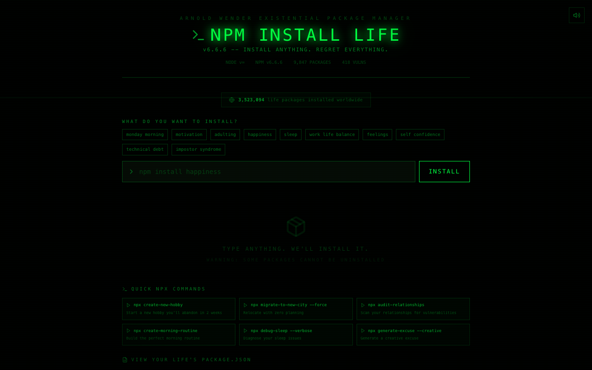

# :package: The Dependency Installer

**npm install but for your life. Finally get those missing packages.**

Built by [Arnold Wender](https://arnoldwender.com)

[](https://the-dependency-installer.netlify.app)

---



## What is this?

Ever wished you could just `npm install self-confidence`? Now you can. The Dependency Installer lets you install life packages like motivation, patience, and financial-stability — complete with realistic install progress, vulnerability scans, and the occasional install failure (just like real npm).

> "Installing self-confidence@latest... 47 vulnerabilities found (23 moderate, 24 existential)"

## Features

- **Life Package Installation** — Install self-confidence, motivation, sleep, and more
- **Vulnerability Scan** — Discover emotional vulnerabilities in your life dependencies
- **Dependency Tree** — Visualize how your life packages depend on each other
- **Install Failures** — Some packages just won't install (looking at you, `work-life-balance`)
- **package.json of Life** — Your complete life configuration file
- **npx Commands** — Run life commands like `npx create-good-day`
- **Achievements** — Unlock badges for installing the hard-to-get packages

## Tech Stack

| Technology | Purpose |
|---|---|
| React 18 | UI framework |
| TypeScript | Type safety |
| Vite | Build tool & dev server |
| Tailwind CSS | Styling |
| Framer Motion | Animations |
| canvas-confetti | Celebration effects |
| html2canvas | Share card generation |
| Web Audio API | Sound effects |
| Lucide React | Icons |

## Getting Started

```bash
# Clone the repo
git clone https://github.com/arnoldwender/the-dependency-installer.git
cd the-dependency-installer

# Install dependencies
npm install

# Start dev server
npm run dev

# Build for production
npm run build
```

## Live Demo

**[https://the-dependency-installer.netlify.app](https://the-dependency-installer.netlify.app)**

## Contributing

Got a life package that needs installing? Check out [CONTRIBUTING.md](./CONTRIBUTING.md) for guidelines on how to get involved.

## License

This project is licensed under the MIT License — see the [LICENSE](./LICENSE) file for details.
